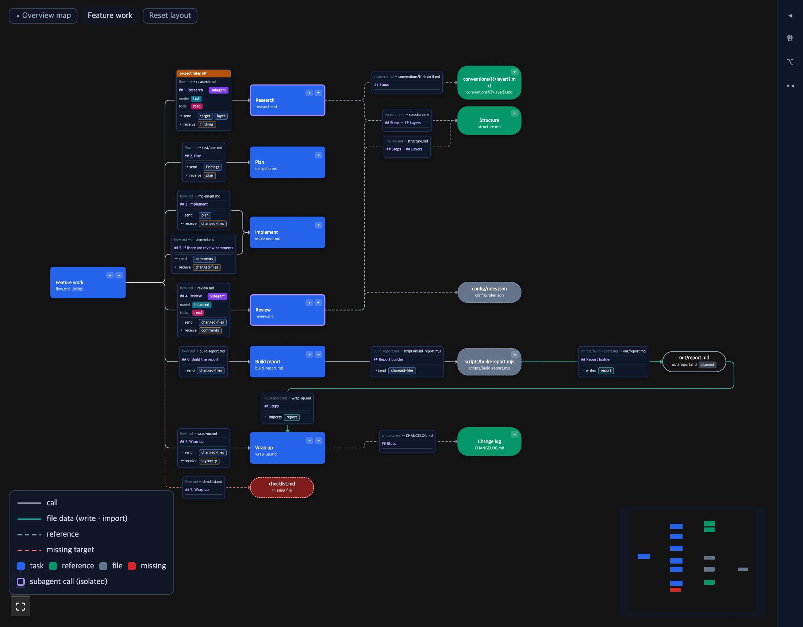
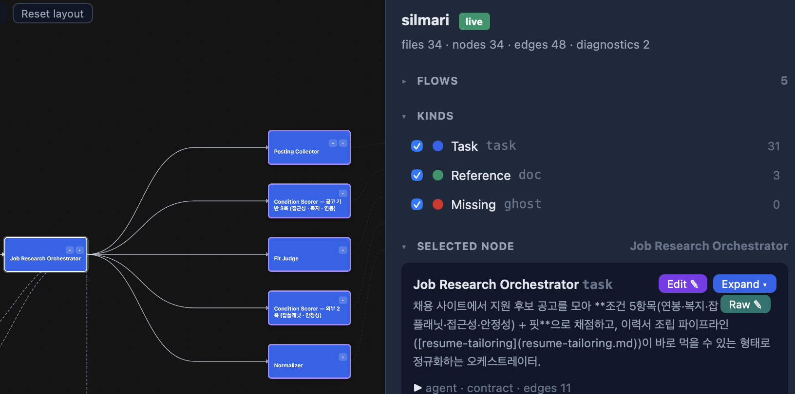
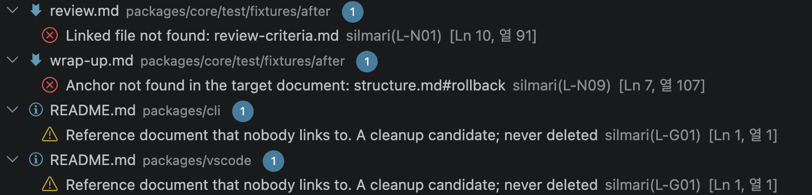

<p align="center"></p>

# silmari

**Checks the flow and data in md documents and shows them as a graph.**
Agent md files are the source, silmari is the compiler, and AI is the runtime. It is like `tsc` for the md files that drive your agents.

```
sil lint    missing files, missing anchors, values sent that the callee does not take, references nobody calls   ← compiler
sil view    calls, send/receive, conditions and subagents between documents on one screen                        ← graph
```

The VS Code extension marks the same checks with wavy lines as you edit and opens the graph beside the editor.

## Install

```sh
npm i -g silmari      # gives you the `sil` command
sil --version
sil --help
```

Node 20 or newer. Without installing: `npx silmari lint`.

VS Code: install the **silmari** extension from the marketplace (publisher `mogiyoon`). It ships the same checker and viewer; the CLI is not required.

## Quick start

```sh
cd my-agent-project     # any folder with md files
sil init                # .sil/config.yaml + SILMARI.md, and a line in CLAUDE.md · AGENTS.md · GEMINI.md · copilot-instructions.md that points agents at it
sil lint                # read every md file, print what is wrong
sil view                # open the graph in the browser; it redraws when a file changes
```

`sil init` records your language (`--lang=ko`, else the locale) so agents write SILMARI.md and their replies in it. Nothing is rewritten by silmari itself.

What `sil lint` prints on the [demo corpus](packages/core/test/fixtures/after):

```
✖ review.md:10  L-N01  Linked file not found: review-criteria.md
✖ wrap-up.md:7  L-N09  Anchor not found in the target document: structure.md#rollback

error 2 · warning 0 · info 0
```

`--strict` makes it exit with code 1 on any error, for CI. `--json` prints the whole graph and diagnostics. Options take `--key=value` or `--key value`.

## Migrating existing documents

If the folder already has md files, `sil init` adds one more line to the agent start files. On its next start the agent asks:

```
Start the silmari migration?
```

Say yes and the agent moves the documents to the notation, following the *Migration* section of `SILMARI.md` rule by rule:

- **One agent, one file.** An agent that was a section inside an orchestrator (`### 1. Analyst — tools · model …`) becomes its own md file; tools and model go in its frontmatter.
- **The contract lives in the called file.** Its input/output bullets become `## Inputs` / `## Steps` / `## Outputs` lists there, not in the caller.
- **One call, one line.** Each step of the orchestrator is a heading with a link and its values: `[Analyst](agents/analyst.md) with {{>posting}} and receive {{<analysis}}`. A retry is a heading that states the condition and the bound.
- **Diagrams, pseudocode and transfer tables stay for people.** The parser cannot read them; what they say is copied onto the call lines.
- **Prose stays prose.** Rationale, error handling and examples are left as they are. The notation appears only on lines with calls.
- **It ends with `sil lint` at error 0.**

silmari does not touch the files. The agent moves the text; `sil lint` checks the result. To run it again later, tell the agent "start the migration" in a session; the line in CLAUDE.md stays. What a flow and its called documents look like after the move is the [demo corpus](packages/core/test/fixtures/after).

## Notation: four things to learn

A standard Markdown link is an edge. Add values after the link with `{{ }}`; they attach to the link before them in the same paragraph. Link paths work like imports: `plan.md`, `./plan.md`, `../agents/plan.md` are relative to the document, and a leading `/` (`/agents/plan.md`) starts at the project root, the folder with `.sil/`.

```markdown
# Feature work

## 1. Research ((use a subagent))
For each target file, call [research](research.md) with {{>target}} and receive {{<findings}}.

## 2. Plan
Call [plan](plan.md) with {{>findings}} and receive {{<plan}}.

## 3. If there are review comments
Call [implement](implement.md) with {{>comments}} and receive {{<changed-files}} again.
```

| Notation | Meaning | For the model |
|---|---|---|
| `[research](research.md)` | Edge. Caller → callee | "Read that file" |
| `{{>plan}}` | Send (parameter) | "Pass this value" |
| `{{<changed-files}}` | Receive (return) | "Keep this value" |
| `## … ((use a subagent))` | Calls in that section are isolated. The double parentheses are the symbol; the words inside can be in any language (`((서브 에이전트 사용))`). Use a verb phrase | "Use a subagent" |

Sequence follows line order. A heading (`## If there are review comments`) marks a choice. Show repetition by calling again under a condition ("until") or with "for each". The only symbols are `>` and `<`.

In the called file, the lists under `## Inputs` / `## Steps` / `## Outputs` are the contract. Other languages: set the words in `.sil/config.yaml`. There is no frontmatter.

**An md file without notation is not an error.** Adopt it one file at a time. [packages/core/test/fixtures/after](packages/core/test/fixtures/after) is a small complete example (it doubles as the golden test corpus).

## What lint catches

| Code | Level | Meaning |
|---|---|---|
| L-N01 | error | Linked file not found |
| L-N09 | error | Anchor not found in the target document |
| L-N03 | error | Reference-style link has no definition |
| L-N04 | error | Invalid value name in `{{ }}` |
| L-N13 | error | `{{ }}` with no link before it to attach to |
| L-N16 | error | The same name is received twice under the same condition |
| L-C01 | warning | Sends values that are not in the callee's inputs |
| L-C02 | warning | Receives values that are not in the callee's outputs |
| L-N14 | warning | Data attached to a reference document (it has no contract) |
| L-G01 | warning | Reference document that nobody links to. A cleanup candidate; never deleted |
| L-G06 | warning | A document is called again without a condition: there is no way out |
| L-N15 | warning | `{{*x}}` is retired notation; write `{{>x}}` and say "for each" in words |
| L-N17 | info | A received value is never used |
| L-N05 | info | A link inside a heading is not an edge |
| L-N06 | info | No H1, or more than one; the file name is used as the title |
| L-I05 | info | Heading label written as `[…]`: write `((…))`, Markdown reads `[ ]` as a reference link |
| L-I04 | info | `[@…]` in a heading label: drop the `@`, models read it as a mention |

Rules that need a contract or a call only run on documents that have one, so plain Markdown stays quiet.

## The graph



- **Flows.** Documents that link to each other form a flow. With more than one flow you start on an overview map; open one to see it.
- **Folding.** A flow opens folded to its first level. On a node, ▸ shows its children, ▸▸ everything below it, ◂ folds it again. The rail buttons ▸▸ / ◂◂ do it for the whole flow. The fold state is saved in `.sil/layout.json`.
- **Lines.** Solid lines are calls that carry values; the label shows what is sent and received and the heading the call sits under. Dashed lines are references. A purple border marks a subagent call. Red dashed lines go to files that do not exist.
- **Labels in two orders.** ⌥ puts each label next to the node it goes to; ☰ keeps the document's line order. Toggle on the rail.
- **Selection.** Click a node: its prompt opens on the right, everything except the node and its neighbours fades. Click empty space to clear.
- **Editing.** *Edit ✎* opens every heading body of the selected document (and the documents it calls) as text fields; one Save writes them back, each into its own heading. *Raw ✎* edits the whole file. Both go through a writer that checks the file hash and keeps a backup, and never touches bytes outside what you changed.
- **Scale.** Tens of thousands of documents work: only changed files are re-parsed, the graph is sent gzipped, and past 2,000 visible nodes the far view is drawn with WebGL while the DOM only holds what is on screen.



The same checks in VS Code's Problems panel:



## Configuration

`sil init` writes `.sil/config.yaml`. Every key is optional.

```yaml
entry: [flow.md]            # entry documents: drawn first, and orphan checks start from them
lang: en                    # the language agents should write in (recorded by sil init)
scan:
  exclude: [drafts/]        # gitignore syntax, on top of .gitignore itself and .git, node_modules, .sil, .claude/worktrees
words:                      # contract heading words, when your documents are not English
  inputs:  [inputs, input, 받는 것]
  outputs: [outputs, output, 내는 것]
  task:    [steps, procedure, 하는 일]
```

`SILMARI.md` is the entry point agents read first: it carries the notation summary and points at the entry documents. The `.sil/layout.json` next to the config holds per-user viewer state (dragged nodes, folds, open panels); add it to `.gitignore`.

## What it never does

- It does not call a model. Prompts go to the model exactly as written. There is no assembler.
- It does not summarize, rewrite, or normalize the text. It does not delete files.
- Outside the folder you run it in, it writes nothing. Inside it, only what you asked for: `sil init` creates the files listed above, and the viewer's Save writes the bytes you edited.

## Development

```sh
pnpm install
pnpm build          # bundles viewer → cli → vscode, in that order
pnpm test           # golden corpus (packages/core/test/fixtures/after) + rule unit tests
pnpm --filter silmari-vscode package   # packages/vscode/dist/silmari.vsix
```

```
packages/core      parser · IR · lint rules · graph · writer. Pure functions, no IO except loadDir. The reference implementation
packages/cli       sil — init · lint · view (local server, incremental parsing, gzip, whole-file edit API)
packages/viewer    React Flow graph: flow map, subtree folding, WebGL + DOM virtualization, label layout, editing, ko/en. vite builds one HTML file
packages/vscode    extension — Diagnostic · graph webview · configurationDefaults
tools/stress.mjs   load-test corpus generator — node tools/stress.mjs <out> [flows] [depth] [fanout]
```

## License

MIT
